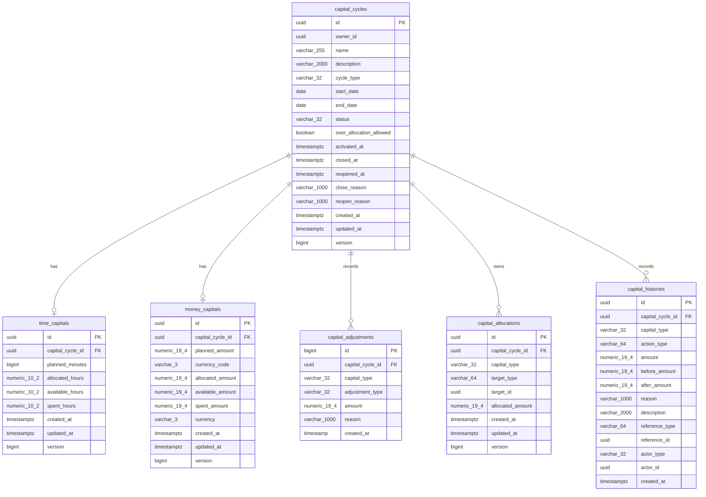

```mermaid
erDiagram
    capital_cycles {
        uuid id PK
        uuid owner_id
        varchar_255 name
        varchar_2000 description
        varchar_32 cycle_type
        date start_date
        date end_date
        varchar_32 status
        boolean over_allocation_allowed
        timestamptz activated_at
        timestamptz closed_at
        timestamptz reopened_at
        varchar_1000 close_reason
        varchar_1000 reopen_reason
        timestamptz created_at
        timestamptz updated_at
        bigint version
    }

    time_capitals {
        uuid id PK
        uuid capital_cycle_id FK
        bigint planned_minutes
        numeric_10_2 allocated_hours
        numeric_10_2 available_hours
        numeric_10_2 spent_hours
        timestamptz created_at
        timestamptz updated_at
        bigint version
    }

    money_capitals {
        uuid id PK
        uuid capital_cycle_id FK
        numeric_19_4 planned_amount
        varchar_3 currency_code
        numeric_19_4 allocated_amount
        numeric_19_4 available_amount
        numeric_19_4 spent_amount
        varchar_3 currency
        timestamptz created_at
        timestamptz updated_at
        bigint version
    }

    capital_adjustments {
        bigint id PK
        uuid capital_cycle_id FK
        varchar_32 capital_type
        varchar_32 adjustment_type
        numeric_19_4 amount
        varchar_1000 reason
        timestamp created_at
    }

    capital_allocations {
        uuid id PK
        uuid capital_cycle_id FK
        varchar_32 capital_type
        varchar_64 target_type
        uuid target_id
        numeric_19_4 allocated_amount
        timestamptz created_at
        timestamptz updated_at
        bigint version
    }

    capital_histories {
        uuid id PK
        uuid capital_cycle_id FK
        varchar_32 capital_type
        varchar_64 action_type
        numeric_19_4 amount
        numeric_19_4 before_amount
        numeric_19_4 after_amount
        varchar_1000 reason
        varchar_2000 description
        varchar_64 reference_type
        uuid reference_id
        varchar_32 actor_type
        uuid actor_id
        timestamptz created_at
    }

    capital_cycles ||--o| time_capitals : "has"
    capital_cycles ||--o| money_capitals : "has"
    capital_cycles ||--o{ capital_adjustments : "records"
    capital_cycles ||--o{ capital_allocations : "owns"
    capital_cycles ||--o{ capital_histories : "records"
```
