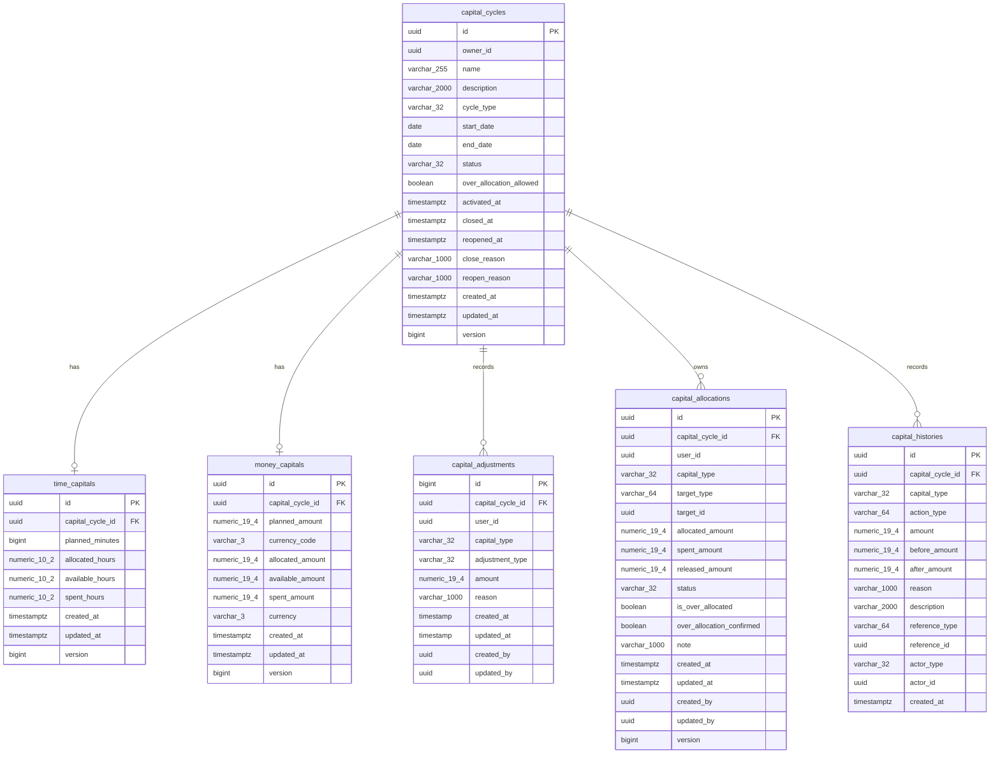

# LifeBalance ERD

This document keeps the deployable database shape and the approved design
surface aligned. Optional Task & Timeline Management features are modeled as
policy-gated storage and are not enabled by this ERD alone.

## Resource Capital Management

## Task & Timeline Management

`tasks`, `categories`, `tags`, `task_tags`, `task_feature_policy_approvals`,
`task_recurring_rules`, and `task_reminders` are backed by Task Service
migrations. `task_planning_associations`, `timeline_placements`, and
`task_history_events` describe the TTM storage target for planning links,
Timeline placement, and history support.

Category and Tag are represented only as Task classification data in TTM. The
ERD does not add a separate Category or Tag business lifecycle beyond their
existing active/soft-delete storage shape.

```mermaid
erDiagram
    users {
        uuid id PK
    }

    tasks {
        uuid id PK
        uuid owner_id FK
        uuid user_id
        uuid category_id FK
        varchar_255 name
        varchar_2000 description
        varchar_32 status
        varchar_32 priority
        date deadline
        integer progress
        integer estimated_minutes
        numeric_19_4 estimated_cost
        timestamptz created_at
        timestamptz updated_at
        timestamptz deleted_at
    }

    categories {
        uuid id PK
        varchar_100 name
        varchar_100 slug
        varchar_20 color
        varchar_50 icon
        boolean is_system
        text description
        timestamptz created_at
        timestamptz updated_at
        timestamptz deleted_at
    }

    tags {
        uuid id PK
        uuid user_id FK
        varchar_100 name
        varchar_100 slug
        varchar_20 color
        boolean is_system
        timestamptz created_at
        timestamptz updated_at
        timestamptz deleted_at
    }

    task_tags {
        uuid task_id PK,FK
        uuid tag_id PK,FK
        timestamptz created_at
    }

    task_planning_associations {
        uuid id PK
        uuid owner_id FK
        uuid task_id FK
        uuid capital_cycle_id FK
        uuid capital_allocation_id FK
        varchar_32 association_type
        varchar_32 resource_type
        varchar_32 status
        numeric_19_4 planned_amount
        varchar_1000 reason
        timestamptz linked_at
        timestamptz released_at
        timestamptz created_at
        timestamptz updated_at
        timestamptz deleted_at
    }

    timeline_placements {
        uuid id PK
        uuid owner_id FK
        uuid task_id FK
        uuid planning_association_id FK
        varchar_32 placement_status
        timestamptz scheduled_start_at
        timestamptz scheduled_end_at
        varchar_64 timezone
        varchar_32 placement_source
        varchar_32 conflict_policy_status
        timestamptz created_at
        timestamptz updated_at
        timestamptz deleted_at
    }

    task_history_events {
        uuid id PK
        uuid owner_id FK
        uuid task_id FK
        uuid timeline_placement_id FK
        varchar_64 event_type
        varchar_32 from_status
        varchar_32 to_status
        jsonb changed_fields
        varchar_1000 reason
        varchar_64 reference_type
        uuid reference_id
        uuid actor_id
        timestamptz created_at
    }

    task_feature_policy_approvals {
        uuid id PK
        uuid owner_id FK
        uuid task_id FK
        varchar_32 feature_code
        varchar_32 approval_status
        timestamptz requested_at
        uuid requested_by
        timestamptz decided_at
        uuid decided_by
        varchar_1000 decision_reason
        timestamptz created_at
        timestamptz updated_at
        timestamptz deleted_at
    }

    task_recurring_rules {
        uuid id PK
        uuid owner_id FK
        uuid task_id FK
        uuid policy_approval_id FK
        varchar_32 policy_feature_code
        varchar_32 policy_approval_status
        varchar_32 rule_status
        varchar_32 frequency
        integer interval_count
        varchar_64 days_of_week
        integer day_of_month
        integer month_of_year
        timestamptz starts_at
        timestamptz ends_at
        varchar_64 timezone
        timestamptz next_run_at
        timestamptz last_run_at
        uuid created_by
        uuid updated_by
        timestamptz created_at
        timestamptz updated_at
        timestamptz deleted_at
    }

    task_reminders {
        uuid id PK
        uuid owner_id FK
        uuid task_id FK
        uuid recurring_rule_id FK
        uuid policy_approval_id FK
        varchar_32 policy_feature_code
        varchar_32 policy_approval_status
        varchar_32 reminder_status
        varchar_32 reminder_kind
        timestamptz remind_at
        varchar_64 timezone
        varchar_32 delivery_channel
        timestamptz sent_at
        timestamptz failed_at
        timestamptz cancelled_at
        varchar_1000 failure_reason
        uuid created_by
        uuid updated_by
        timestamptz created_at
        timestamptz updated_at
        timestamptz deleted_at
    }

    capital_cycles {
        uuid id PK
        uuid owner_id
    }

    capital_allocations {
        uuid id PK
        uuid capital_cycle_id FK
        uuid user_id
        varchar_64 target_type
        uuid target_id
    }

    users ||--o{ tasks : "owns"
    users ||--o{ tags : "owns"
    categories ||--o{ tasks : "classifies"
    tasks ||--o{ task_tags : "has"
    tags ||--o{ task_tags : "labels"

    tasks ||--o{ task_planning_associations : "plans"
    capital_cycles ||--o{ task_planning_associations : "planning cycle"
    capital_allocations ||--o{ task_planning_associations : "resource allocation"
    tasks ||--o{ capital_allocations : "target_type TASK"

    tasks ||--o{ timeline_placements : "placed on timeline"
    task_planning_associations ||--o{ timeline_placements : "enables placement"

    tasks ||--o{ task_history_events : "records changes"
    timeline_placements ||--o{ task_history_events : "records moves"

    tasks ||--o{ task_feature_policy_approvals : "requests optional feature"
    task_feature_policy_approvals ||--o{ task_recurring_rules : "approved recurring"
    task_feature_policy_approvals ||--o{ task_reminders : "approved reminder"
    tasks ||--o{ task_recurring_rules : "may repeat"
    tasks ||--o{ task_reminders : "may remind"
    task_recurring_rules ||--o{ task_reminders : "creates occurrence reminders"
```

## Policy Notes

- A Task belongs to exactly one owner. Timeline, history, optional rules, and
  planning links must remain owner-scoped.
- Timeline placement is separate from Task planning. A Planned Task can exist
  without a Timeline placement; a Scheduled Task must have valid placement
  data and enough approved Time Capital or equivalent policy allowance.
- `capital_allocations.target_type = 'TASK'` is the resource planning bridge
  from Resource Capital Management to TTM.
- Recurring rules and reminders require explicit approved policy decisions.
  Preparing the tables does not enable optional features or seed approvals.
- Task history captures meaningful Task status, planning, Timeline movement,
  recurring, and reminder events. Category/Tag lifecycle history is intentionally
  not expanded in this ERD.
