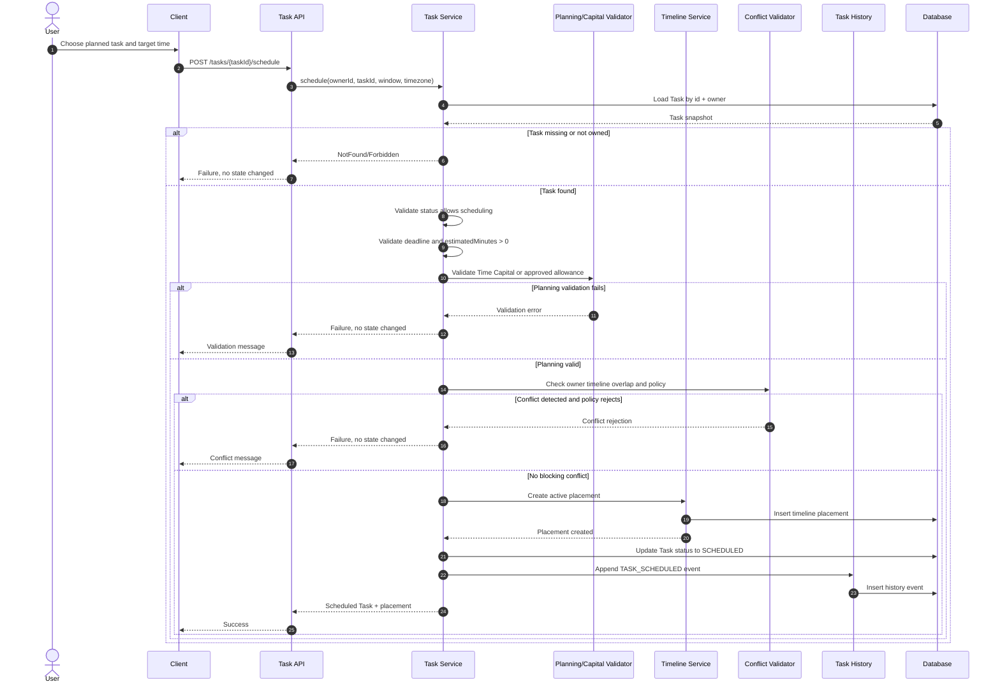
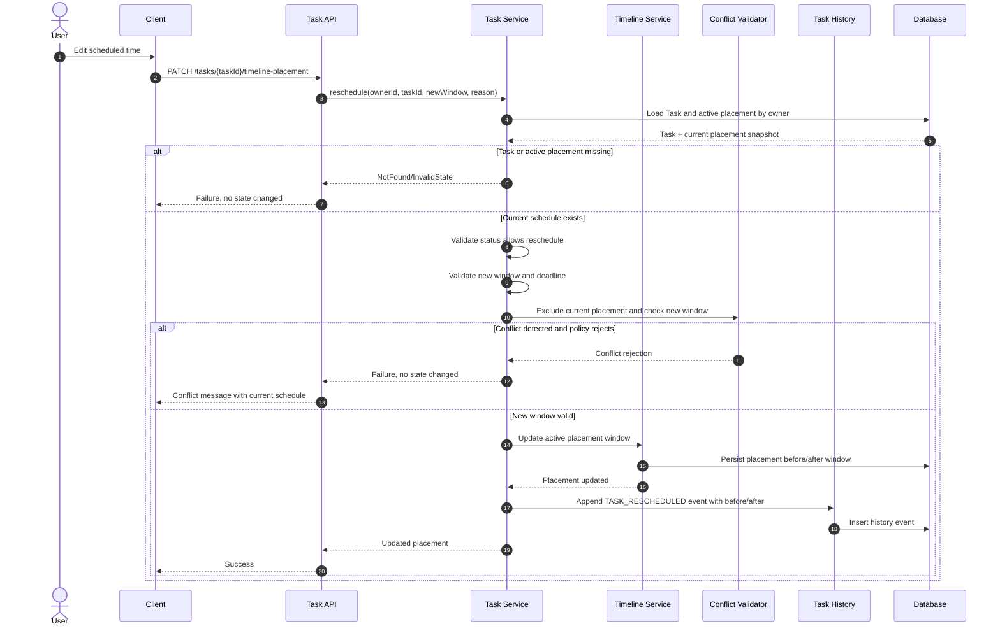
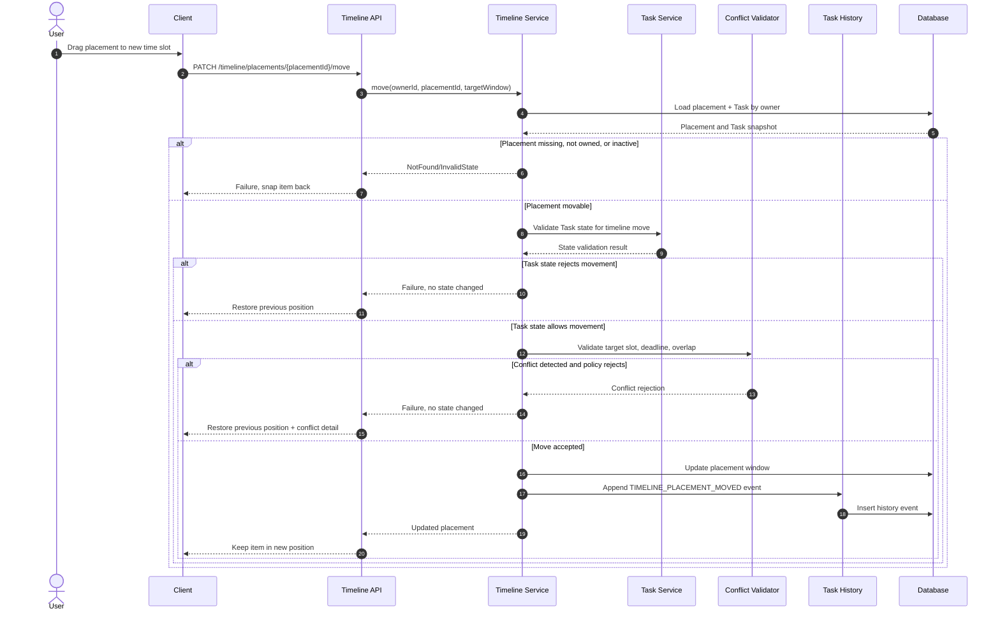
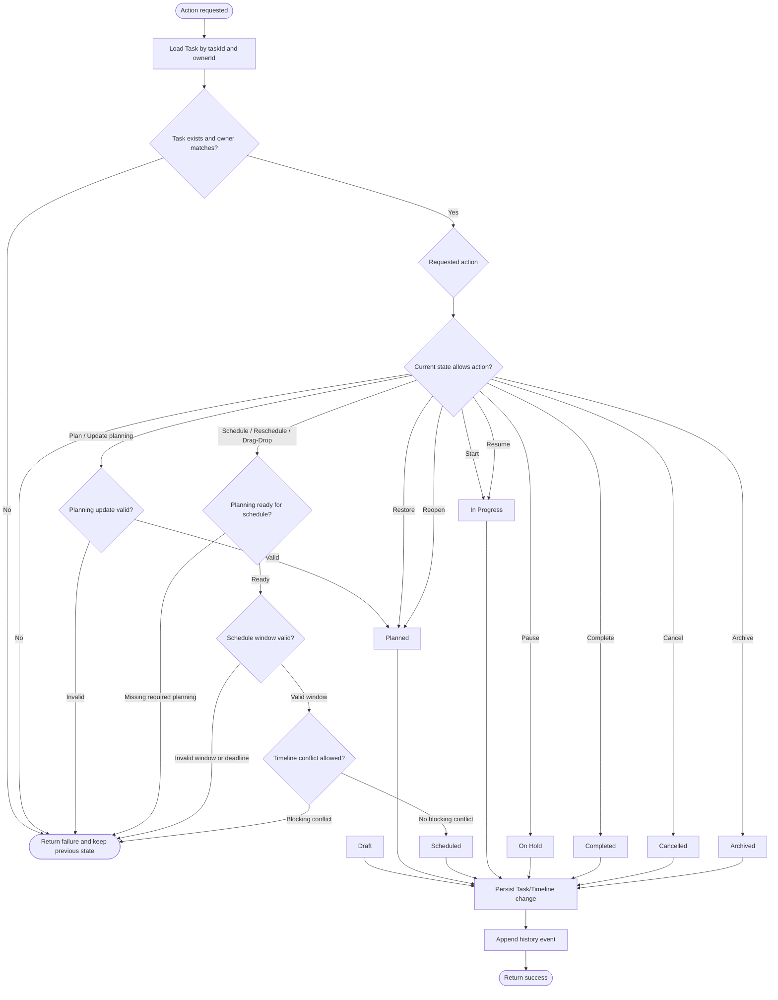
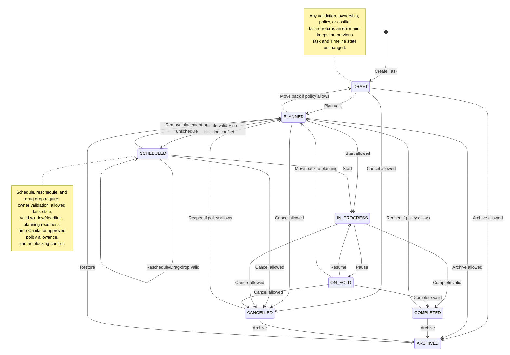

# Task & Timeline Diagrams

These diagrams document the Task & Timeline Management behavior around
scheduling, rescheduling, drag-drop movement, and lifecycle transitions. They
are intentionally policy-aware: validation and conflict failure paths return an
error response without changing Task state, Timeline placement, planning
association, or history.

## Schedule Task Sequence

## Reschedule Task Sequence

## Drag-Drop Timeline Sequence

## Task Lifecycle Activity

## Lifecycle State Map

